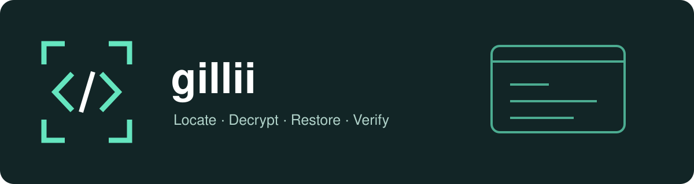

# Gillii



<p align="center"><a href="README.md">English</a> · <strong>简体中文</strong></p>

用一个 Shell 命令查找微信小程序缓存、解密包文件，并还原可阅读的客户端代码。同时支持分析 Android APK，导出受支持类型的可读代码和资源。

- 恢复微信小程序缓存，合并同版本分包并生成静态分析报告。
- 分析 APK，反编译 Java/托管代码，按实际识别结果导出 Unity 资源。
- 提供离线 HTML/JSON 报告、文件哈希和复现步骤。
- 提供多平台 AI Agent 使用指南。

## AI Agent 支持

已提供 Codex、DSH、Claude Code、Gemini CLI、Cursor 和 GitHub Copilot 的项目入口，共用 [AGENTS.md](AGENTS.md)。命令调用、报告处理、退出码与加载方式见 [AI Agent 接入指南](docs/AI-AGENTS.md)。

## 安装

### Homebrew（推荐）

```bash
brew install leo1394/gillii/gillii
```

Homebrew 自动安装 Node.js 和 Python。发布包自带恢复依赖，无需本地编译。

### Bash (Linux / macOS)

需要 Bash 3.2+、Node.js 22+。

```bash
curl -fsSL https://raw.githubusercontent.com/leo1394/homebrew-gillii/master/install.sh | bash
```

安装器自动下载最新正式版并校验 SHA256，默认安装到 `~/.local`。如果 `~/.local/bin` 不在 PATH 中，按安装提示添加。再次运行安装器即可升级。已在 macOS 验证；Linux 恢复流程尚未验证。

## APK 分析

自 v0.2.0 起提供。需要 Bash 3.2+、Node.js 22+ 和 Python 3.10+（Homebrew 自动安装 Node 和 Python）。源码目录中可执行：

```bash
./bin/gillii chase /absolute/path/app.apk
./bin/gillii chase /absolute/path/app.apk --output ./apk-result
```

`--output` 必须是尚不存在的目录，父目录需已存在。

- 按实际内容创建导出目录；大小写冲突资源分别保存，并记录原始名称与导出路径映射。
- 保留 JADX 正常输出；反编译报错时，另行尝试简化指令导出。
- 失败或部分成功时，高亮提示原因及 `logs/execution.log`、工具日志路径；完全成功后删除过程日志，保留报告和证据。
- 打开 `index.html` 或读取 `report.json`：退出码 **0 完成、2 部分成功、1 失败**。

恢复结果不保证能构建为原工程。Flutter、Unity IL2CPP 和原生库保留清单与二进制，不还原其原始 Dart/C#/C++ 源码。

首轮面向 macOS；Linux APK 恢复尚未验证，暂不支持 Windows。依赖、离线操作和输出说明见 [APK 文档](docs/APK.md)。

## 快速上手

主要只需三个命令：

```bash
gillii list
gillii clean
gillii chase wx0123456789abcdef
```

不知道 AppID 时，先退出桌面微信，执行 `gillii clean`，重新打开微信并只访问目标小程序。再用 `gillii list` 获取 AppID，执行 `gillii chase <AppID>`。

`clean` 永久删除发现的 `.wxapkg` 包，保留其他数据。`chase` 自动选择最新可读主包、拷贝、解密和逆向；发布包自带依赖，源码安装首次执行会通过 npm 准备依赖，无需单独 setup。结果位于当前目录的 `./<AppID>-<唯一后缀>/source`，同时保留原包、日志和 report.json。重复执行会创建新目录。

还会生成 `index.html` 离线索引、`docs/analysis.md` 静态分析和 `docs/reproduction.md` 复现步骤；`evidence/` 提供原始/源码文件哈希、页面分包、权限组件、直接 API 调用及 URL 常量证据。失败时也保留报告。原有 `complete_cached` 状态保持不变，覆盖状态单独标为部分结果。详见[小程序报告说明](docs/MINI-PROGRAM-REPORTS.md)。

macOS 权限受限时，在系统设置中授权终端后重试。手动复制缓存或指定输出位置的可选参数可通过 `gillii help chase` 查看。

## 限制与开发

支持已验证的 V1MMWX 格式、主包、插件及本机测试过的编译模板格式，自动合并同版本已缓存分包。未缓存页面会在 report.json 中列出，状态为 `complete_cached`，表示已有缓存恢复成功。不恢复服务端代码、原始变量名，也不保证运行和渲染等价。不发送业务接口请求。重复运行安装器可升级；最终替换前失败会保留既有可执行文件，配套文件安装并非整体原子事务。

运行 `bash tests/test.sh` 检查命令和安装器，运行 `python3 -B -m unittest discover -s tests` 检查 APK 辅助模块；`publish.sh --prepare` 也会使用发布包内的依赖检查恢复逻辑。参见[第三方说明](THIRD-PARTY.md)、[手册](man/gillii.1)和[验证记录](docs/VALIDATION.md)。贡献时保留格式并增加针对行为的测试。采用 GPL-3.0-or-later，[许可证](LICENSE)。不添加赞助入口。
